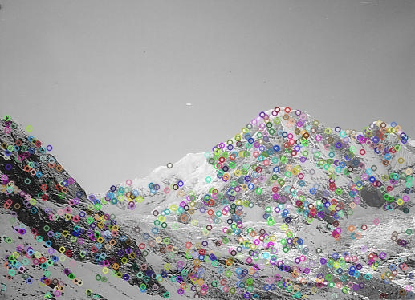
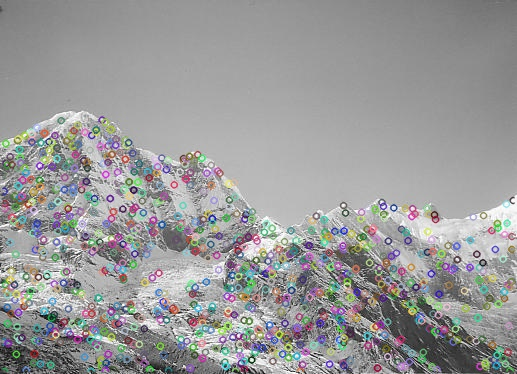
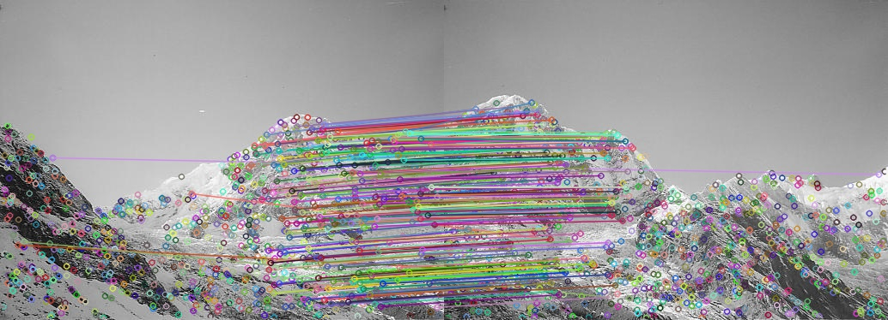
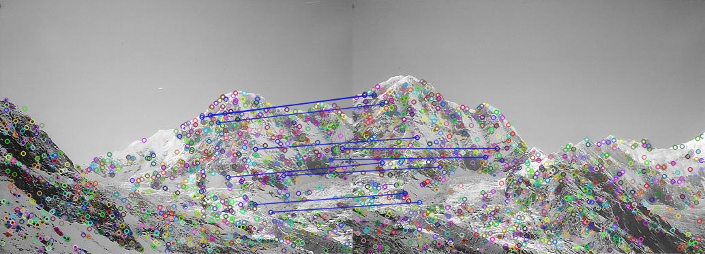
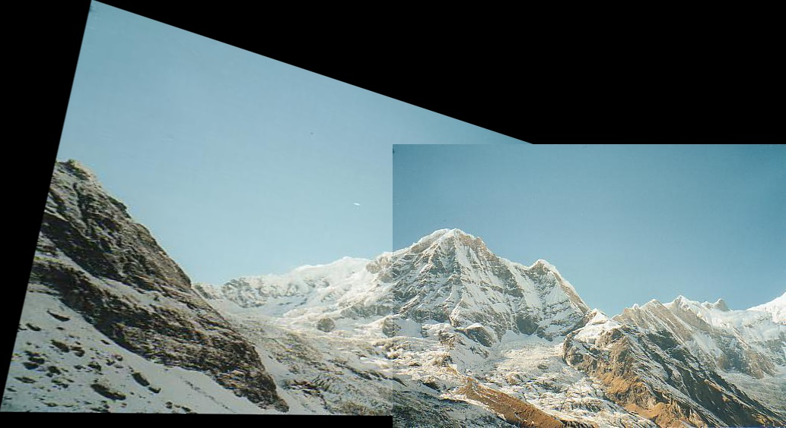

# Panoramic-Image-using-SIFT
Creating a Panoramic image from 2 images using SIFT, and wrap
1.  Creating SIFT images to find the key points of the 2 images. 

    
  
  <figcaption>
SIFT Image Left
</figcaption>

    
  
  <figcaption>
SIFT Image Right
</figcaption>

2.  Then perform Homography which relates the transformation between two plane by using RANSAC Algorithm

3.  KNN matching is then applied to find the similar points in the two images.

    
  
  <figcaption>
KNN Matches
</figcaption>

4.  Find the 10 best matches

    
  
  <figcaption>
KNN Matches
</figcaption>

4.  We then warp the 2 images to get the panoramic image

    
  
  <figcaption>
Panorama
</figcaption>

